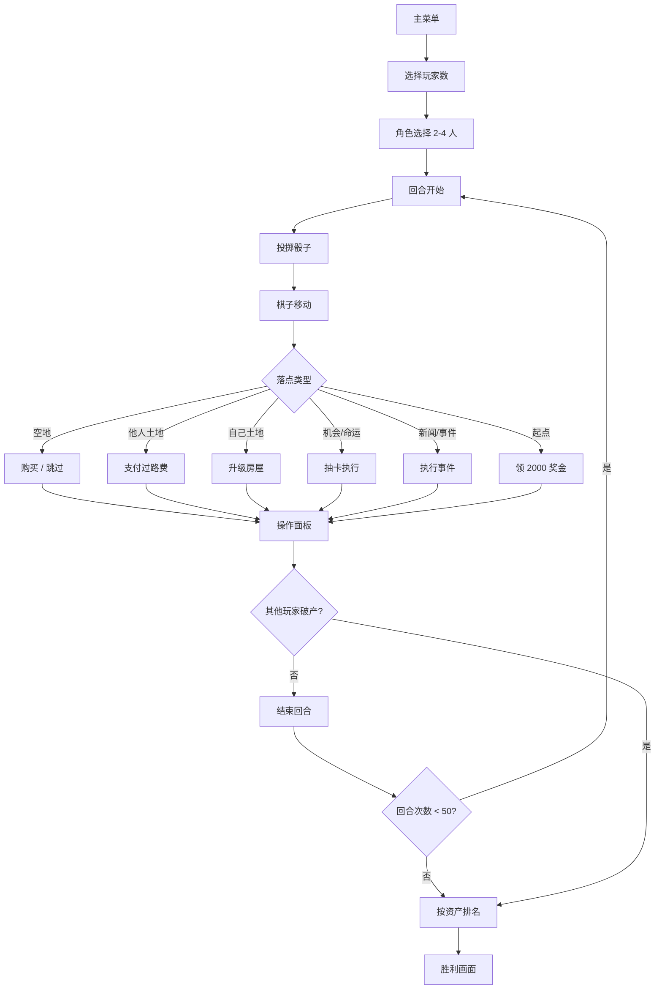

# 大富翁4 - 产品需求文档 (PRD)

## 1. 产品概述

**大富翁4 网页复刻版** —— 一款忠实还原大宇资讯 1998 年经典《大富翁 4》核心玩法的多人/单人休闲桌游网页版，采用原版"台湾之旅"地图，玩家通过投掷骰子、移动棋子、购买土地、建造房屋、买卖股票等方式积累资产，最终目标为让其他玩家破产。

- **核心问题**：让玩家无需安装即可在浏览器中体验童年经典桌游。
- **目标用户**：怀旧玩家、休闲游戏玩家、桌游爱好者。
- **产品价值**：免费、零门槛、原汁原味还原的网页版大富翁 4。

## 2. 核心功能

### 2.1 用户角色
| 角色 | 注册方式 | 核心权限 |
|------|----------|----------|
| 玩家 | 无需登录，本地选择 | 选择角色、操控游戏、查看资产 |
| AI 对手 | 系统自动控制 | 简化决策的电脑玩家 |

### 2.2 功能模块

1. **主菜单**：游戏标题、开始游戏、游戏说明、退出
2. **角色选择**：选择 2-4 名玩家，每位玩家可选不同角色头像（孙小美、阿土仔、钱夫人、乌咪……）
3. **游戏主界面**：台湾地图、玩家面板、操作面板
4. **股票系统**：4 只股票实时涨跌，玩家可买卖
5. **卡片系统**：机会卡、命运卡事件
6. **地产系统**：购地、盖屋、盖旅馆、收取过路费
7. **事件系统**：新闻、仙药、乌龟、财神、穷神、医院、监狱
8. **结算系统**：破产、胜利判定

### 2.3 页面详情
| 页面名称 | 模块名称 | 功能描述 |
|---------|---------|---------|
| 主菜单 | 标题画面 | 居中标题，背景图，开始/说明按钮 |
| 角色选择 | 角色卡片 | 4 个可选角色，每个有头像、初始资金、专属说明 |
| 游戏主界面 | 台湾地图 | 36 格环绕台湾岛的经典地图，每个格子显示名称、颜色、价格 |
| 游戏主界面 | 玩家面板 | 4 个玩家的现金、存款、资产、股票、卡片 |
| 游戏主界面 | 操作面板 | 投骰子、结束回合、买地、盖屋、买卖股票 |
| 弹窗 | 事件弹窗 | 卡片事件、新闻播报、商店购买 |
| 弹窗 | 玩家破产 | 资产清算、退出游戏提示 |
| 结束 | 胜利画面 | 胜利者展示、名次 |

## 3. 核心流程

## 4. 用户界面设计

### 4.1 设计风格

- **主色调**：暖色调复古桌面风格（深棕 #3E2A1E、米色 #F4E1B7、淡金 #E8C56A）
- **辅助色**：中国红 #C73E3A、墨绿 #2C5F3D、宝蓝 #2A4A7F
- **按钮风格**：3D 凸起立体按钮，带阴影与高光
- **字体**：标题用 `Press Start 2P` 或 `ZCOOL KuaiLe`（中文字体），正文用 `Noto Sans TC`
- **布局风格**：卡片化居中布局，棋盘占据中央主要空间
- **图标风格**：可爱卡通风格，融合中文字符
- **整体氛围**：仿古桌游、木纹背景、骰子/金币等元素装饰

### 4.2 页面设计概述

| 页面名称 | 模块名称 | UI 元素 |
|---------|---------|---------|
| 主菜单 | 标题 | 居中大字标题，副标题，木纹背景 |
| 主菜单 | 按钮 | 立体 3D 按钮，hover 时上浮 |
| 角色选择 | 角色卡 | 圆形头像，金色边框，下方名称 |
| 角色选择 | 确认按钮 | 选中后高亮，开始游戏按钮置灰 / 高亮 |
| 游戏主界面 | 棋盘 | 中央 SVG 渲染的 36 格台湾地图，背景为台湾岛形状 |
| 游戏主界面 | 玩家面板 | 左侧或右侧 4 列玩家卡片，竖直排列 |
| 游戏主界面 | 操作面板 | 底部操作条，投骰子、结束回合、买地、盖屋、卖股 |
| 游戏主界面 | 状态栏 | 顶部显示当前回合玩家、回合数、股票市场 |
| 弹窗 | 卡片弹窗 | 中央弹出卡牌 + 描述，3D 翻转动画 |
| 弹窗 | 新闻播报 | 报纸风格弹窗，可关闭 |
| 弹窗 | 商店 | 物品列表 + 描述 + 价格 |
| 结束 | 胜利画面 | 烟花/彩带效果，胜利者高亮 |

### 4.3 响应式设计

桌面优先，最佳视口 1280×720 至 1920×1080。平板可自适应缩放，移动端不做强制适配（仅保证可用）。

### 4.4 视觉效果

- 棋子移动使用 CSS transition 平滑过渡
- 卡片弹出使用 3D 翻转动画
- 骰子投掷使用随机滚动 + 3D 旋转
- 玩家破产时角色缩小淡出
- 资金变化时数字滚动 + 高亮闪烁
- 地图格子 hover 时高亮当前玩家位置
- 股票价格变动时 K 线波动动画
