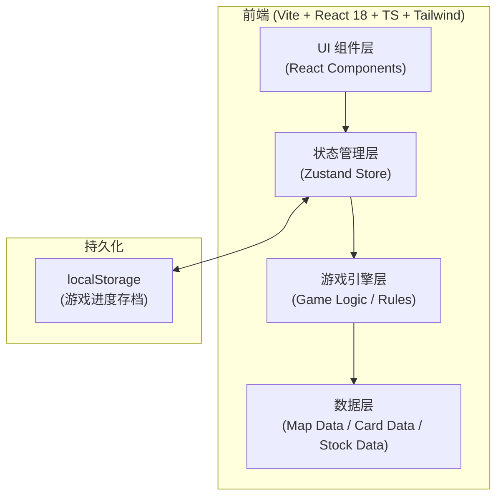
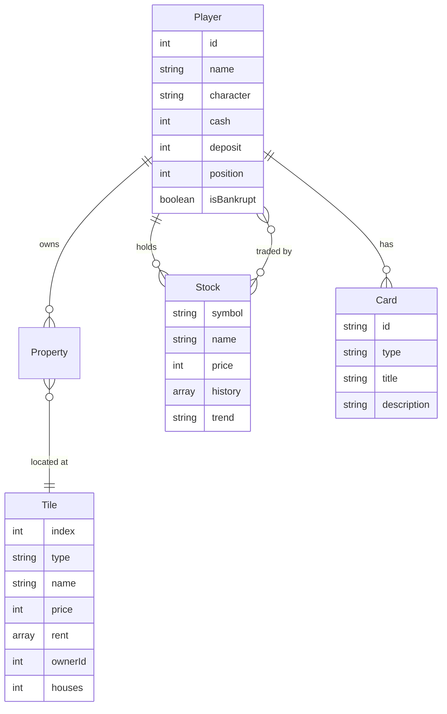

# 大富翁4 - 技术架构文档

## 1. 架构设计



## 2. 技术描述

- **前端框架**：React 18 + TypeScript + Vite
- **样式方案**：Tailwind CSS 3 + CSS Modules（用于关键动画）
- **状态管理**：Zustand（轻量、TS 友好、API 简洁）
- **路由**：react-router-dom（主菜单 ↔ 游戏界面）
- **后端**：无（纯前端单机游戏，状态保存在 localStorage）
- **数据存储**：静态数据 + localStorage（可恢复游戏进度）
- **UI 图标库**：lucide-react
- **特殊依赖**：
  - 3D 翻转动画：CSS 3D Transform（无第三方）
  - 骰子动画：Framer Motion（轻量动画库）
  - SVG 地图：内联 SVG + React 组件化
- **初始化工具**：`vite-init` (react-ts 模板)

## 3. 路由定义

| 路由 | 用途 |
|------|------|
| `/` | 主菜单 |
| `/select` | 角色选择 |
| `/game` | 游戏主界面 |
| `/help` | 游戏说明 |

## 4. API 定义

本项目为纯前端无后端，无 RESTful API。仅在 Zustand Store 中定义以下核心 TypeScript 类型：

```typescript
// 玩家
type Player = {
  id: number;
  name: string;
  character: 'sunxiaomei' | 'atu' | 'qian' | 'wumi';
  cash: number;
  deposit: number;
  position: number;
  stocks: Record<string, number>;  // 股票代码 -> 持股数
  cards: Card[];
  isBankrupt: boolean;
  isAI: boolean;
  inJail: boolean;
  jailTurns: number;
  color: string;
};

// 格子
type Tile = {
  index: number;
  type: 'start' | 'property' | 'chance' | 'fate' | 'news' | 'shop'
      | 'hospital' | 'jail' | 'park' | 'lottery' | 'immortal'
      | 'turtle' | 'fortune' | 'misfortune' | 'empty';
  name: string;
  color?: string;        // 地产主色
  price?: number;        // 购地价
  rent?: number[];       // [空地, 1房, 2房, 3房, 4房, 旅馆]
  housePrice?: number;   // 盖房价
  ownerId?: number | null;
  houses: number;        // 0-5 (0=空地, 5=旅馆)
  description?: string;
};

// 卡片
type Card = {
  id: string;
  type: 'chance' | 'fate';
  title: string;
  description: string;
  effect: CardEffect;
};

// 股票
type Stock = {
  symbol: string;        // 例: 'MSFT', 'IBM', 'AAPL', 'TSM'
  name: string;
  price: number;
  history: number[];     // 走势
  trend: 'up' | 'down' | 'flat';
};

// 游戏状态
type GameState = {
  players: Player[];
  tiles: Tile[];
  stocks: Stock[];
  currentPlayerIndex: number;
  round: number;
  dice: [number, number];
  phase: 'idle' | 'rolling' | 'moving' | 'event' | 'turnEnd';
  log: GameLogEntry[];
  winnerId?: number;
};
```

## 5. 服务器架构图

无后端，N/A。

## 6. 数据模型

### 6.1 数据模型定义



### 6.2 数据定义（静态种子数据）

#### 6.2.1 台湾地图（36 格）

```typescript
const TAIWAN_MAP: Tile[] = [
  { index: 0,  type: 'start',      name: '起点',    description: '经过或停留可领 $2000' },
  { index: 1,  type: 'property',   name: '淡水',    color: 'blue',   price: 600,  rent: [20, 100, 300, 600, 1100, 1500], housePrice: 300 },
  { index: 2,  type: 'chance',     name: '机会' },
  { index: 3,  type: 'property',   name: '基隆',    color: 'blue',   price: 600,  rent: [40, 200, 600, 1200, 2200, 3000], housePrice: 300 },
  { index: 4,  type: 'lottery',    name: '乐透' },
  { index: 5,  type: 'property',   name: '新竹',    color: 'blue',   price: 800,  rent: [60, 300, 900, 1800, 2800, 3800], housePrice: 400 },
  { index: 6,  type: 'news',       name: '新闻' },
  { index: 7,  type: 'property',   name: '桃园',    color: 'green',  price: 1000, rent: [80, 400, 1200, 2400, 3600, 5000], housePrice: 500 },
  { index: 8,  type: 'immortal',   name: '仙药' },
  { index: 9,  type: 'property',   name: '中坜',    color: 'green',  price: 1000, rent: [100, 500, 1500, 3000, 4500, 6000], housePrice: 500 },
  { index: 10, type: 'fate',       name: '命运' },
  { index: 11, type: 'property',   name: '台中',    color: 'green',  price: 1200, rent: [120, 600, 1800, 3600, 5500, 7500], housePrice: 600 },
  { index: 12, type: 'shop',       name: '道具屋' },
  { index: 13, type: 'property',   name: '彰化',    color: 'red',    price: 1400, rent: [140, 700, 2100, 4200, 6500, 9000], housePrice: 700 },
  { index: 14, type: 'chance',     name: '机会' },
  { index: 15, type: 'property',   name: '嘉义',    color: 'red',    price: 1400, rent: [160, 800, 2400, 4800, 7500, 10000], housePrice: 700 },
  { index: 16, type: 'turtle',     name: '乌龟' },
  { index: 17, type: 'property',   name: '台南',    color: 'red',    price: 1600, rent: [180, 900, 2700, 5500, 8500, 11500], housePrice: 800 },
  { index: 18, type: 'fate',       name: '命运' },
  { index: 19, type: 'property',   name: '高雄',    color: 'yellow', price: 1800, rent: [200, 1000, 3000, 6000, 9500, 13000], housePrice: 900 },
  { index: 20, type: 'property',   name: '屏东',    color: 'yellow', price: 1800, rent: [220, 1100, 3300, 6600, 10500, 14000], housePrice: 900 },
  { index: 21, type: 'news',       name: '新闻' },
  { index: 22, type: 'property',   name: '宜兰',    color: 'yellow', price: 2000, rent: [240, 1200, 3600, 7200, 11500, 15500], housePrice: 1000 },
  { index: 23, type: 'chance',     name: '机会' },
  { index: 24, type: 'property',   name: '花莲',    color: 'purple', price: 2200, rent: [260, 1300, 3900, 7800, 12500, 17000], housePrice: 1100 },
  { index: 25, type: 'fortune',    name: '财神' },
  { index: 26, type: 'property',   name: '台东',    color: 'purple', price: 2200, rent: [280, 1400, 4200, 8400, 13500, 18500], housePrice: 1100 },
  { index: 27, type: 'fate',       name: '命运' },
  { index: 28, type: 'misfortune', name: '穷神' },
  { index: 29, type: 'property',   name: '澎湖',    color: 'purple', price: 2400, rent: [300, 1500, 4500, 9000, 14500, 20000], housePrice: 1200 },
  { index: 30, type: 'jail',       name: '监狱',    description: '入狱 3 回合' },
  { index: 31, type: 'property',   name: '金门',    color: 'orange', price: 2600, rent: [320, 1600, 4800, 9600, 15500, 21000], housePrice: 1300 },
  { index: 32, type: 'shop',       name: '卡片屋' },
  { index: 33, type: 'property',   name: '马祖',    color: 'orange', price: 2600, rent: [340, 1700, 5100, 10200, 16500, 22500], housePrice: 1300 },
  { index: 34, type: 'park',       name: '公园',    description: '停留一回合 奖励 $500' },
  { index: 35, type: 'property',   name: '绿岛',    color: 'orange', price: 2800, rent: [360, 1800, 5400, 10800, 17500, 24000], housePrice: 1400 },
];
```

#### 6.2.2 角色数据

```typescript
const CHARACTERS = [
  { id: 'sunxiaomei', name: '孙小美',  desc: '建筑费用 -10%', cash: 15000, color: 'pink' },
  { id: 'atu',        name: '阿土仔',  desc: '过路费 +20%',  cash: 15000, color: 'blue' },
  { id: 'qian',       name: '钱夫人',  desc: '现金 +20%',    cash: 18000, color: 'red' },
  { id: 'wumi',       name: '乌咪',    desc: '股票收益 +30%',cash: 15000, color: 'purple' },
];
```

#### 6.2.3 股票数据

```typescript
const INITIAL_STOCKS: Stock[] = [
  { symbol: 'MSFT', name: '微软',   price: 50, history: [], trend: 'flat' },
  { symbol: 'IBM',  name: 'IBM',    price: 80, history: [], trend: 'flat' },
  { symbol: 'AAPL', name: '苹果',   price: 60, history: [], trend: 'flat' },
  { symbol: 'TSM',  name: '台积电', price: 40, history: [], trend: 'flat' },
];
```

#### 6.2.4 卡片数据

约 30 张机会卡 + 30 张命运卡，覆盖移动、金钱、股票、卡片、监狱、玩家干扰等效果。

## 7. 项目结构

```
/workspace
├── .trae/
│   └── documents/
│       ├── PRD.md
│       └── TECH.md
├── public/
│   └── favicon.svg
├── src/
│   ├── components/
│   │   ├── board/        # 棋盘、格子、棋子
│   │   ├── player/       # 玩家面板、角色卡
│   │   ├── modals/       # 卡片、新闻、商店、破产弹窗
│   │   ├── controls/     # 投骰、结束回合、操作按钮
│   │   └── common/       # 通用 UI 组件
│   ├── pages/
│   │   ├── Home.tsx
│   │   ├── Select.tsx
│   │   ├── Game.tsx
│   │   └── Help.tsx
│   ├── store/
│   │   └── gameStore.ts  # Zustand 全局状态
│   ├── engine/
│   │   ├── rules.ts      # 落点处理、支付、租金
│   │   ├── dice.ts
│   │   ├── cards.ts      # 卡片效果执行
│   │   ├── stocks.ts     # 股票涨跌算法
│   │   └── ai.ts         # 电脑玩家决策
│   ├── data/
│   │   ├── map.ts
│   │   ├── characters.ts
│   │   ├── cards.ts
│   │   └── stocks.ts
│   ├── hooks/
│   │   ├── useGameLoop.ts
│   │   └── useAnimation.ts
│   ├── utils/
│   │   ├── random.ts
│   │   └── format.ts
│   ├── App.tsx
│   └── main.tsx
├── index.html
├── package.json
├── tailwind.config.js
├── postcss.config.js
├── tsconfig.json
└── vite.config.ts
```
